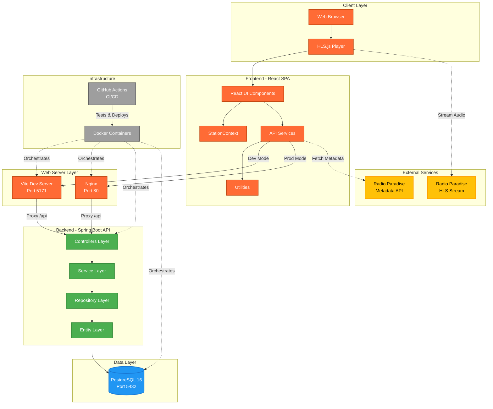
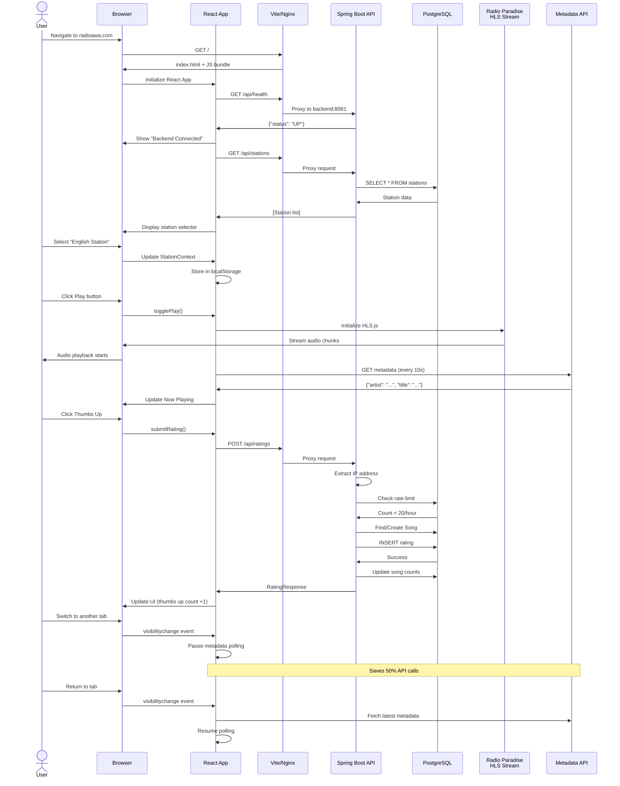
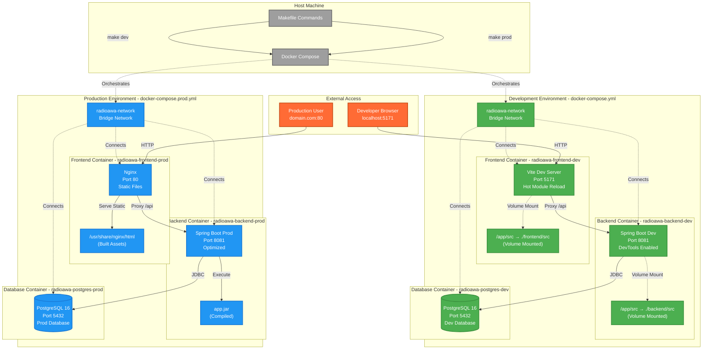
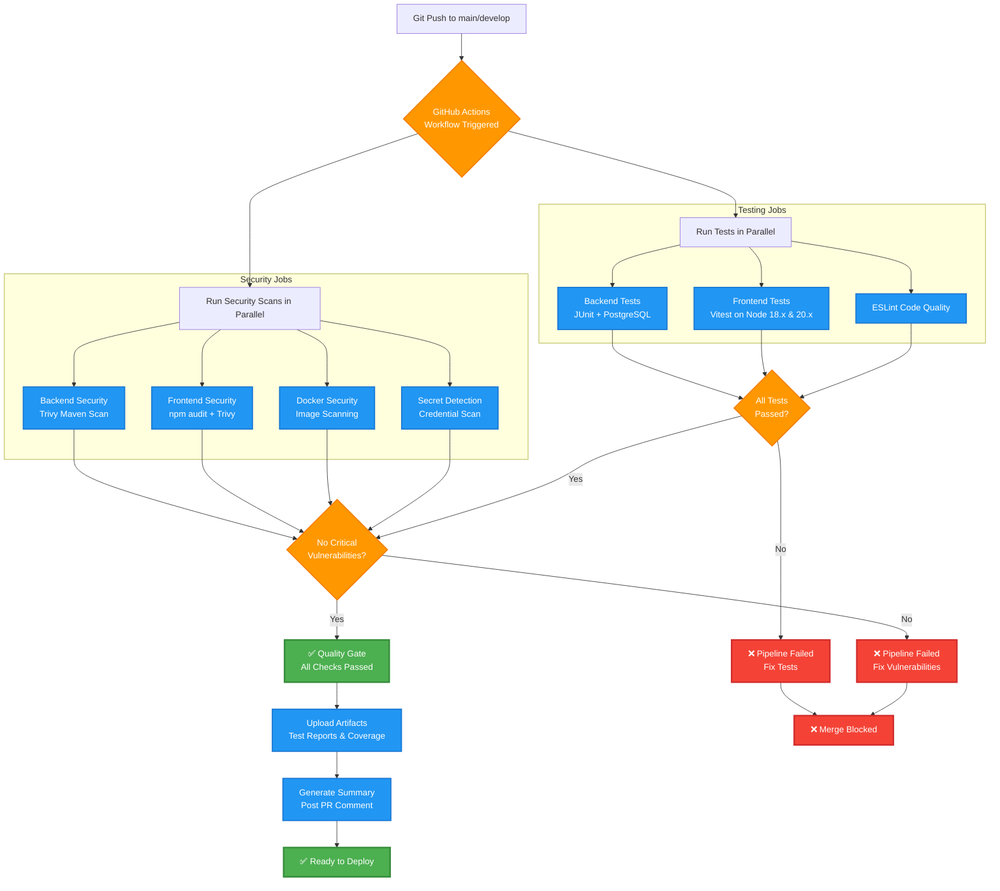
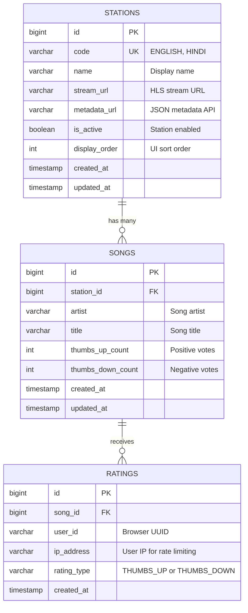
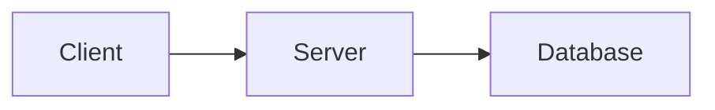
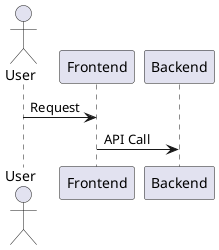
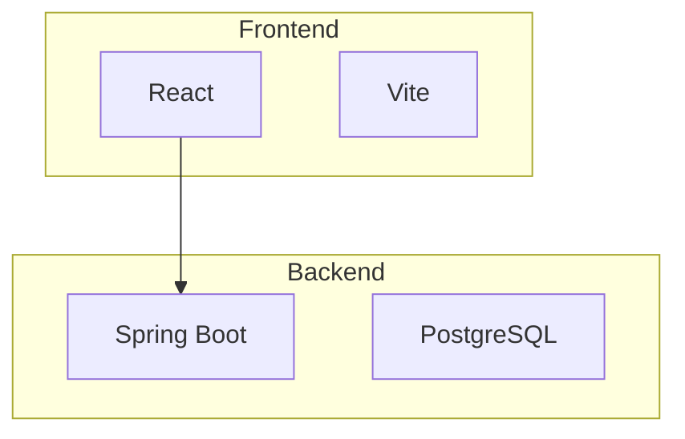
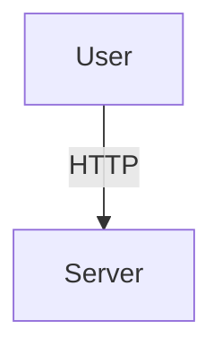

# RadioAWA System Architecture Diagrams

**Project**: RadioAWA - Lossless Audio Streaming Platform
**Author**: Sujit K Singh
**Last Updated**: December 27, 2024
**Version**: 1.0

---

## Table of Contents

1. [High-Level System Architecture](#high-level-system-architecture)
2. [Component Interaction Flow](#component-interaction-flow)
3. [Data Flow Diagram](#data-flow-diagram)
4. [Deployment Architecture](#deployment-architecture)
5. [CI/CD Pipeline](#cicd-pipeline)
6. [Database Schema](#database-schema)
7. [Why Mermaid Format?](#why-mermaid-format)
8. [Mermaid vs Other Formats](#mermaid-vs-other-formats)
9. [How to Render Mermaid Diagrams](#how-to-render-mermaid-diagrams)

---

## High-Level System Architecture

This diagram shows the complete RadioAWA system architecture with all major components and their interactions.



**Key Components**:
- **Frontend**: React 19 + Vite 7 with HLS.js streaming
- **Backend**: Spring Boot 3.2.1 REST API
- **Database**: PostgreSQL 16 relational database
- **External**: Radio Paradise for audio streaming and metadata
- **Infrastructure**: Docker for containerization, GitHub Actions for CI/CD

---

## Component Interaction Flow

This sequence diagram shows the complete user interaction flow from page load to playing audio and rating songs.



**Key Interactions**:
1. **Page Load**: React app initializes, checks backend health, loads stations
2. **Audio Playback**: HLS.js streams audio directly from external source
3. **Metadata Polling**: Fetches song info every 10 seconds (pauses when tab hidden)
4. **Rating System**: Validates rate limits, stores votes, returns updated counts
5. **Performance**: Tab visibility API reduces background API calls by 50%

---

## Data Flow Diagram

This diagram illustrates how data flows through the RadioAWA system from external sources to the user interface.

```mermaid
graph LR
    subgraph "External Data Sources"
        HLS_Stream[HLS Audio Stream<br/>stream.radioparadise.com]
        Metadata_API[Metadata JSON API<br/>api.radioparadise.com]
    end

    subgraph "Frontend Data Flow"
        HLS_Player[HLS.js Player]
        State[React State<br/>useState/Context]
        LocalStorage[Browser LocalStorage]
        UI_Components[UI Components]
    end

    subgraph "Backend Data Flow"
        API_Layer[REST Controllers]
        Service_Layer[Business Logic]
        Repository[JPA Repositories]
    end

    subgraph "Data Storage"
        PostgreSQL_DB[(PostgreSQL)]
        Cache[HikariCP<br/>Connection Pool]
    end

    %% Audio Stream Flow
    HLS_Stream -->|Audio Chunks| HLS_Player
    HLS_Player -->|Decoded Audio| UI_Components

    %% Metadata Flow
    Metadata_API -->|JSON| State
    State -->|Props| UI_Components

    %% User Interaction Flow
    UI_Components -->|User Actions| State
    State -->|API Requests| API_Layer

    %% Station Persistence
    State <-->|Read/Write| LocalStorage

    %% Backend Processing
    API_Layer -->|Validate & Route| Service_Layer
    Service_Layer -->|Business Rules| Repository
    Repository -->|JDBC| Cache
    Cache <-->|SQL Queries| PostgreSQL_DB

    %% Response Flow
    PostgreSQL_DB -->|Query Results| Cache
    Cache -->|Entity Objects| Repository
    Repository -->|DTOs| Service_Layer
    Service_Layer -->|JSON Response| API_Layer
    API_Layer -->|HTTP Response| State
    State -->|Update UI| UI_Components
    UI_Components -->|Display| User[👤 User]

    classDef source fill:#FFC107,stroke:#FFA000,stroke-width:2px
    classDef frontend fill:#FF6B35,stroke:#C1440E,stroke-width:2px,color:#FFF
    classDef backend fill:#4CAF50,stroke:#388E3C,stroke-width:2px,color:#FFF
    classDef storage fill:#2196F3,stroke:#1976D2,stroke-width:2px,color:#FFF

    class HLS_Stream,Metadata_API source
    class HLS_Player,State,LocalStorage,UI_Components frontend
    class API_Layer,Service_Layer,Repository backend
    class PostgreSQL_DB,Cache storage
```



**Data Flow Patterns**:
1. **Audio Stream**: External HLS → HLS.js → Browser Audio API
2. **Metadata**: External JSON → React State → UI Components
3. **User Input**: UI → React State → Backend API → Database
4. **Persistence**: React Context ↔ LocalStorage (station selection)
5. **Database**: JPA Entities ↔ HikariCP ↔ PostgreSQL

---

## Deployment Architecture

This diagram shows how RadioAWA is deployed in development and production environments using Docker.



**Deployment Modes**:

| Aspect | Development (`make dev`) | Production (`make prod`) |
|--------|--------------------------|--------------------------|
| **Frontend** | Vite dev server (HMR) | Nginx (static files) |
| **Port** | 5171 | 80 |
| **Hot Reload** | ✅ Yes (volume mounted) | ❌ No (immutable) |
| **Backend** | Spring DevTools | Optimized JAR |
| **Profile** | `SPRING_PROFILES_ACTIVE=dev` | `SPRING_PROFILES_ACTIVE=prod` |
| **Logging** | Verbose (DEBUG) | Minimal (INFO) |
| **Build Time** | Fast (incremental) | Slower (full build) |
| **Use Case** | Local development | Deployment/Testing |

---

## CI/CD Pipeline

This diagram shows the GitHub Actions CI/CD pipeline that runs on every commit.



**Pipeline Stages**:

1. **Trigger**: Push to `main` or `develop` branch
2. **Parallel Testing**:
   - Backend: JUnit with PostgreSQL container
   - Frontend: Vitest on Node 18.x and 20.x (matrix)
   - Linting: ESLint checks
3. **Parallel Security**:
   - Backend: Trivy scans Maven dependencies
   - Frontend: npm audit + Trivy scans npm packages
   - Docker: Trivy scans container images
   - Secrets: Detects exposed credentials
4. **Quality Gate**: All checks must pass
5. **Artifacts**: Upload test results and coverage reports
6. **Summary**: Generate pipeline report and PR comment

**Outcomes**:
- ✅ **Success**: All tests pass, no critical vulnerabilities → Ready to deploy
- ❌ **Failure**: Tests fail or vulnerabilities found → Merge blocked

---

## Database Schema

This Entity-Relationship diagram shows the database structure and relationships.



**Entity Descriptions**:

### STATIONS
- **Purpose**: Stores radio station configuration
- **Key Fields**:
  - `code`: Unique station identifier (e.g., "ENGLISH", "HINDI")
  - `stream_url`: External HLS stream endpoint
  - `metadata_url`: External metadata JSON API
- **Indexes**:
  - Primary key on `id`
  - Unique constraint on `code`

### SONGS
- **Purpose**: Stores unique songs per station
- **Key Fields**:
  - `station_id`: Foreign key to STATIONS (station isolation)
  - `artist`, `title`: Song identification
  - `thumbs_up_count`, `thumbs_down_count`: Aggregated vote counts
- **Indexes**:
  - Primary key on `id`
  - Composite index on `(artist, title, station_id)` for lookups
  - Foreign key index on `station_id`
- **Constraints**: UNIQUE(artist, title, station_id) - one song record per station

### RATINGS
- **Purpose**: Individual user votes for songs
- **Key Fields**:
  - `song_id`: Foreign key to SONGS
  - `user_id`: Browser-generated UUID (client-side)
  - `ip_address`: User IP for rate limiting (server-side)
  - `rating_type`: Enum (THUMBS_UP | THUMBS_DOWN)
- **Indexes**:
  - Primary key on `id`
  - Composite index on `(song_id, user_id)` for duplicate prevention
  - Composite index on `(ip_address, created_at)` for rate limit queries
  - Foreign key index on `song_id`
- **Constraints**: UNIQUE(song_id, user_id) - one vote per user per song

**Data Isolation**: All data is scoped by station - songs and ratings are station-specific.

**Rate Limiting Query**:
```sql
-- Check if IP exceeded 20 votes/hour for a station
SELECT COUNT(*)
FROM ratings r
JOIN songs s ON r.song_id = s.id
WHERE r.ip_address = ?
  AND s.station_id = ?
  AND r.created_at > NOW() - INTERVAL '1 hour';
```

---

## Why Mermaid Format?

Mermaid is a **text-based diagram syntax** that renders into visual diagrams in markdown files, GitHub, GitLab, and documentation platforms. It's become the industry standard for technical documentation.

### Key Advantages

#### 1. **Version Control Friendly** ⭐⭐⭐⭐⭐
```
✅ Text-based (not binary)
✅ Git diffs work perfectly
✅ Merge conflicts are rare and resolvable
✅ Full commit history tracking
```

**Example Git Diff**:
```diff
 graph TB
     Frontend --> Backend
+    Backend --> Database
-    Backend --> Cache
```

Compare with **binary image**:
```diff
Binary files diagram_v1.png and diagram_v2.png differ
```
❌ No visibility into what changed

---

#### 2. **Single Source of Truth** ⭐⭐⭐⭐⭐
```
✅ Diagram lives in the same repo as code
✅ No external tools required (Draw.io, Visio)
✅ No broken links to Google Drive/Confluence
✅ Automatically updated in documentation
```

**Problem with External Diagrams**:
```markdown
<!-- Bad: External link -->

❌ Link breaks when file moves
❌ Access permissions required
❌ No version history
```

**Mermaid Solution**:
```markdown
<!-- Good: Embedded diagram -->
```mermaid
graph TB
    A --> B
\```
✅ Always accessible
✅ Versioned with code
✅ Self-contained
```

---

#### 3. **GitHub/GitLab Native Support** ⭐⭐⭐⭐⭐

Renders automatically in:
- GitHub README.md
- GitHub Issues & Pull Requests
- GitLab documentation
- GitHub Wikis
- VS Code (with extensions)

**No build step required!**

---

#### 4. **Easy to Maintain** ⭐⭐⭐⭐⭐

Updating diagrams is as simple as editing text:

```diff
 sequenceDiagram
     User->>Frontend: Click Button
     Frontend->>Backend: POST /api/data
+    Backend->>Database: INSERT INTO table
     Backend->>Frontend: 200 OK
```

**Compare with image-based diagrams**:
1. Open Draw.io / Visio
2. Find original file (if it exists)
3. Make changes
4. Export as PNG
5. Upload to repo
6. Update markdown link

⏱️ Mermaid: **30 seconds**
⏱️ Image: **5-10 minutes**

---

#### 5. **Documentation as Code** ⭐⭐⭐⭐

Fits into modern DevOps practices:
```bash
# Docs are code, so they follow same workflow
git checkout -b feature/add-cache-layer
# Edit diagram in Mermaid
git commit -m "Add cache layer to architecture diagram"
git push
# Create PR → CI/CD validates → Merge → Auto-deploy docs
```

---

#### 6. **Consistency Across Team** ⭐⭐⭐⭐

- Everyone uses the same syntax
- No "artistic differences" in diagram styles
- Automatic styling (or theme-able)
- Reduces bikeshedding

---

#### 7. **CI/CD Integration** ⭐⭐⭐⭐

Can validate diagrams in CI/CD:
```yaml
# .github/workflows/docs.yml
- name: Validate Mermaid Diagrams
  run: npx @mermaid-js/mermaid-cli validate **/*.md
```

❌ Can't do this with PNG/JPG images

---

#### 8. **Search & Grep Friendly** ⭐⭐⭐

```bash
# Find all diagrams mentioning "Backend"
grep -r "Backend" *.md

# Find all sequence diagrams
grep -r "sequenceDiagram" *.md
```

❌ Can't search inside images

---

#### 9. **Accessibility** ⭐⭐⭐

- Screen readers can parse text
- Dark mode support (automatic)
- Responsive (scales to screen size)
- Can be translated

❌ Images are not accessible

---

#### 10. **Cost** ⭐⭐⭐⭐⭐

- **Free** and open source
- No license fees (vs Visio, Lucidchart)
- No cloud storage costs
- Works offline

---

### Real-World Benefits for RadioAWA

| Benefit | Impact |
|---------|--------|
| **Onboarding** | New developers see up-to-date diagrams in README |
| **Code Reviews** | Reviewers see diagram changes in PR diffs |
| **Documentation** | Diagrams never go stale (live with code) |
| **Knowledge Sharing** | Architecture visible to all team members |
| **Maintenance** | Update diagrams in seconds, not minutes |
| **CI/CD** | GitHub Actions auto-validates diagrams |

---

## Mermaid vs Other Formats

### Comparison Matrix

| Feature | Mermaid | PlantUML | Draw.io | Visio | Markdown | ASCII Art |
|---------|---------|----------|---------|-------|----------|-----------|
| **Text-Based** | ✅ Yes | ✅ Yes | ❌ No (XML) | ❌ No (Binary) | ✅ Yes | ✅ Yes |
| **Git-Friendly** | ✅ Excellent | ✅ Good | ⚠️ Poor | ❌ Terrible | ✅ Excellent | ✅ Excellent |
| **GitHub Renders** | ✅ Native | ❌ Needs plugin | ❌ No | ❌ No | ✅ Native | ✅ Yes |
| **Learning Curve** | ⚠️ Moderate | ⚠️ Steep | ✅ Easy | ⚠️ Moderate | ✅ Easy | ❌ Hard |
| **Diagram Types** | ⭐⭐⭐⭐ | ⭐⭐⭐⭐⭐ | ⭐⭐⭐⭐⭐ | ⭐⭐⭐⭐⭐ | ⭐ | ⭐ |
| **Visual Quality** | ⭐⭐⭐⭐ | ⭐⭐⭐ | ⭐⭐⭐⭐⭐ | ⭐⭐⭐⭐⭐ | ⭐⭐ | ⭐ |
| **Maintenance** | ✅ Easy | ✅ Easy | ⚠️ Medium | ⚠️ Medium | ✅ Easy | ❌ Hard |
| **Collaboration** | ✅ Excellent | ✅ Good | ⚠️ Medium | ⚠️ Medium | ✅ Excellent | ✅ Good |
| **Cost** | ✅ Free | ✅ Free | ✅ Free | ❌ Paid | ✅ Free | ✅ Free |
| **Offline** | ✅ Yes | ✅ Yes | ⚠️ Desktop app | ⚠️ Desktop app | ✅ Yes | ✅ Yes |
| **CI/CD** | ✅ Easy | ✅ Possible | ❌ Hard | ❌ No | ✅ Easy | ✅ Easy |

---

### Detailed Comparison

#### 1. **Mermaid** (Recommended ⭐)

**Best For**: Modern software teams using GitHub/GitLab

**Pros**:
- ✅ Native GitHub/GitLab support
- ✅ Simple syntax (close to markdown)
- ✅ Fast rendering
- ✅ Active community
- ✅ Great for most common diagrams

**Cons**:
- ⚠️ Limited diagram types vs PlantUML
- ⚠️ Less control over styling
- ⚠️ Can't do complex custom shapes

**Use Cases**:
- System architecture diagrams ✅
- Sequence diagrams ✅
- Flowcharts ✅
- ER diagrams ✅
- State diagrams ✅

**Example**:


---

#### 2. **PlantUML**

**Best For**: Teams needing advanced UML diagrams

**Pros**:
- ✅ Most diagram types (20+)
- ✅ Very powerful and flexible
- ✅ Text-based
- ✅ Large ecosystem

**Cons**:
- ❌ No native GitHub rendering
- ❌ Steeper learning curve
- ❌ Requires Java runtime
- ❌ Slower rendering

**Use Cases**:
- Complex UML diagrams
- Detailed class diagrams
- Deployment diagrams
- Timing diagrams

**Example**:


**Verdict**: Use PlantUML if Mermaid can't do what you need. Otherwise, Mermaid is simpler.

---

#### 3. **Draw.io / Diagrams.net**

**Best For**: Complex visual diagrams with custom shapes

**Pros**:
- ✅ WYSIWYG editor
- ✅ Beautiful output
- ✅ Unlimited customization
- ✅ Free

**Cons**:
- ❌ XML-based (binary-ish)
- ❌ Poor git diffs
- ❌ Requires external tool
- ❌ No GitHub rendering

**Use Cases**:
- Marketing materials
- Complex network diagrams
- Presentations

**Verdict**: Great for one-off diagrams, but terrible for living documentation.

---

#### 4. **Microsoft Visio**

**Best For**: Enterprise environments already using MS Office

**Pros**:
- ✅ Professional output
- ✅ Familiar UI
- ✅ Integration with Office

**Cons**:
- ❌ Expensive ($300/license)
- ❌ Binary files
- ❌ Terrible for version control
- ❌ Windows only

**Verdict**: Avoid for technical documentation. Use Mermaid instead.

---

#### 5. **Markdown Tables/Text**

**Best For**: Simple data structures

**Pros**:
- ✅ Universal support
- ✅ Easy to write
- ✅ Git-friendly

**Cons**:
- ❌ Can't show relationships
- ❌ No visual flow
- ❌ Limited to tables/lists

**Example**:
```markdown
| Component | Tech |
|-----------|------|
| Frontend  | React |
| Backend   | Spring Boot |
```

**Verdict**: Use for simple tables, Mermaid for diagrams.

---

#### 6. **ASCII Art**

**Best For**: Quick terminal-based diagrams

**Pros**:
- ✅ Works everywhere
- ✅ No tools needed
- ✅ Git-friendly

**Cons**:
- ❌ Ugly
- ❌ Hard to maintain
- ❌ Time-consuming

**Example**:
```
     +--------+       +----------+
     | Client |------>| Server   |
     +--------+       +----------+
                           |
                           v
                      +----------+
                      | Database |
                      +----------+
```

**Verdict**: Only for quick sketches. Use Mermaid for real docs.

---

### When to Use What?

| Diagram Type | First Choice | Alternative |
|--------------|--------------|-------------|
| System Architecture | **Mermaid** | PlantUML |
| Sequence Diagram | **Mermaid** | PlantUML |
| Flowchart | **Mermaid** | Draw.io |
| ER Diagram | **Mermaid** | PlantUML |
| Class Diagram (simple) | **Mermaid** | PlantUML |
| Class Diagram (complex) | PlantUML | Mermaid |
| Network Topology | Draw.io | Mermaid |
| Presentation | Draw.io | Mermaid |
| Quick Sketch | ASCII | Mermaid |

---

### RadioAWA Decision: Why We Chose Mermaid

1. ✅ **GitHub Native**: Renders in README, PRs, Issues
2. ✅ **Low Barrier**: Easy for all developers to update
3. ✅ **Version Control**: Perfect git diffs
4. ✅ **Sufficient**: Covers all our diagram needs
5. ✅ **CI/CD**: Can validate in GitHub Actions
6. ✅ **Future-Proof**: Growing ecosystem and support

**Alternatives Considered**:
- ❌ **PlantUML**: Too complex for our needs
- ❌ **Draw.io**: Poor version control
- ❌ **Visio**: Cost prohibitive, not open-source friendly

---

## How to Render Mermaid Diagrams

### Method 1: GitHub/GitLab (Automatic)

Simply put Mermaid code in markdown files:

````markdown
```mermaid
graph LR
    A --> B
\```
````

Renders automatically in:
- GitHub README.md
- Pull Requests
- Issues
- Wikis

---

### Method 2: VS Code (Recommended for Development)

**Install Extension**:
1. Open VS Code
2. Extensions → Search "Mermaid"
3. Install "Markdown Preview Mermaid Support"
4. Open any `.md` file
5. Press `Cmd+Shift+V` (Mac) or `Ctrl+Shift+V` (Windows)

**Live Preview**: Changes render instantly!

---

### Method 3: Mermaid Live Editor (Online)

**URL**: https://mermaid.live

1. Paste Mermaid code
2. See live preview
3. Export as PNG/SVG/PDF
4. Share link with team

**Use Case**: Quick prototyping, sharing with non-technical stakeholders

---

### Method 4: CLI (Automated Export)

```bash
# Install Mermaid CLI
npm install -g @mermaid-js/mermaid-cli

# Convert markdown to images
mmdc -i diagram.md -o diagram.png

# Generate all diagrams in docs/
mmdc -i 'docs/**/*.md' -o 'docs/images/'
```

**Use Case**: CI/CD pipelines, generating PDFs

---

### Method 5: Mermaid in HTML

```html
<!DOCTYPE html>
<html>
<head>
  <script src="https://cdn.jsdelivr.net/npm/mermaid/dist/mermaid.min.js"></script>
  <script>mermaid.initialize({startOnLoad:true});</script>
</head>
<body>
  <div class="mermaid">
    graph LR
        A --> B
  </div>
</body>
</html>
```

**Use Case**: Documentation websites, GitHub Pages

---

### Method 6: Documentation Platforms

Supported natively by:
- **GitLab**: ✅ Yes
- **GitHub**: ✅ Yes
- **Notion**: ✅ Yes
- **Confluence**: ⚠️ Via plugin
- **MkDocs**: ✅ Yes (pymdown-extensions)
- **Docusaurus**: ✅ Yes (plugin)
- **Sphinx**: ✅ Yes (sphinxcontrib-mermaid)

---

## Best Practices for Mermaid Diagrams

### 1. Keep Diagrams Focused

```
✅ Good: One diagram per concept
❌ Bad: One massive diagram with everything
```

### 2. Use Subgraphs for Grouping



### 3. Add Comments



### 4. Use Descriptive Labels

```mermaid
graph LR
    ✅ A[User Browser] --> B[Spring Boot API]
    ❌ A --> B
```

### 5. Version Your Diagrams

Add metadata at the top:
```markdown
<!--
System Architecture Diagram
Version: 1.2
Last Updated: 2024-12-27
Author: Sujit K Singh
-->
```

### 6. Test Rendering

Before committing, verify diagrams render correctly:
1. VS Code preview
2. Mermaid Live Editor
3. Local GitHub Pages preview

---

## Troubleshooting

### Diagram Not Rendering on GitHub?

**Check**:
1. ✅ Code fence is ` ```mermaid ` (with language tag)
2. ✅ No syntax errors in Mermaid code
3. ✅ GitHub supports your diagram type
4. ✅ File extension is `.md` (not `.txt`)

### Syntax Errors?

Use **Mermaid Live Editor** (https://mermaid.live) to validate syntax.

### Complex Diagram Too Slow?

1. Split into multiple smaller diagrams
2. Reduce node count
3. Simplify relationships

---

## Resources

- **Official Docs**: https://mermaid.js.org
- **Live Editor**: https://mermaid.live
- **GitHub Guide**: https://github.blog/2022-02-14-include-diagrams-markdown-files-mermaid/
- **Diagram Types**: https://mermaid.js.org/intro/syntax-reference.html
- **VS Code Extension**: https://marketplace.visualstudio.com/items?itemName=bierner.markdown-mermaid

---

**Maintained By**: Sujit K Singh
**Last Reviewed**: December 27, 2024
**Version**: 1.0
